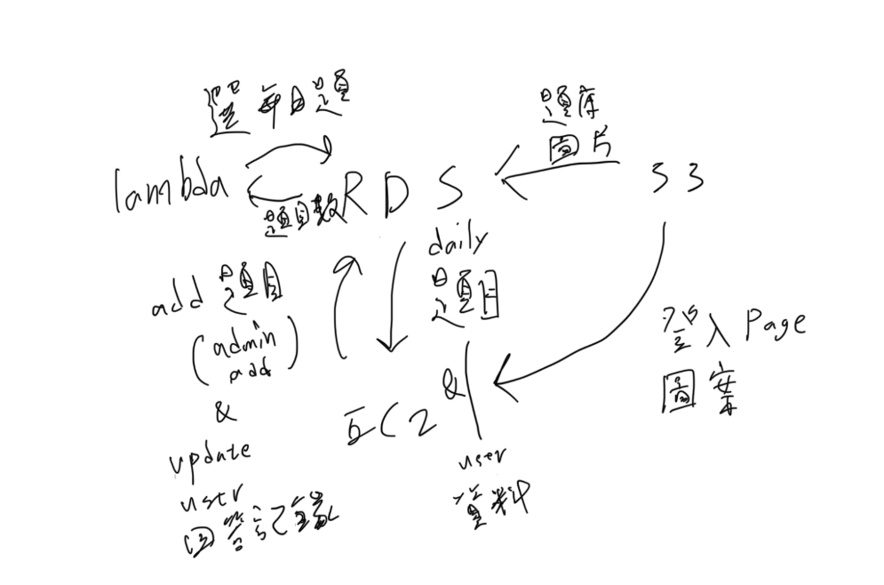

# final
cloudcompute_final_project

IAM沒有辦法用，所以沒辦法用程式加圖片到s3  

EC2:
登入畫面 + 回答問題畫面（題目來自當日題目DB）+ admin新增題目（圖片沒辦法）+ 註冊（成功會自動登入）。  
RDS:
用戶（ID, 帳號密碼、答題次數、正確次數、正確率）+ 題庫（題目ID、題目敘述、答案、圖片）+ 當日題目（日期、題目ID）+ 答題記錄 (用戶ID、題目ID、日期、是否正確)。  
lambda:
定期推送從題庫中抽取1題推送到當日題目(都是DB)。  
S3:
存要用的素材。  

要改的地方：  
lambda_function：裡面的db_settings要改成rds的參數   
dblink.php：改資料庫的連線（應該只需要改這個，如果有問題可以檢查看看其他的php檔，可能我有忘記改的）    
rds/questionbase.sql：pic的裡面的連結也要改自己存的s3位址  
index.html：cube放的連結（s3）  

s3資料夾裡的檔案要自己傳上s3  
rds資料夾裡的sql指令可以直接在mysql workbench裡執行就會建立好table，但是記得要先改題庫的圖片連結  
lambda要上傳select_daily_question.zip  

所有功能：  
index.html：登入頁面，眼睛可以解除密碼隱藏，下方可以註冊帳號，帳密輸錯會提示，用admin身分的帳號可以到admin.html。  
question.html：要作答過才能看解析，左上會顯示目前登入的帳號有沒有答過這題（Unsolved, Attempted, Solved)，可以登出，提交答案後會根據你的回答給提示("答對了！", "答錯了，請再試一次", "你已經答對過這題，無需再答", "這次你答對了！已更新紀錄", "你之前答錯過這題，這次也沒對 😢")。  
admin.html：新增題目用的，解析可以不寫，會自動在mysql裡變成""。  
register.html：註冊帳號，不能有同個帳號，註冊成功會自動登入，下面的已有帳號？登入可以回到index.html。  
